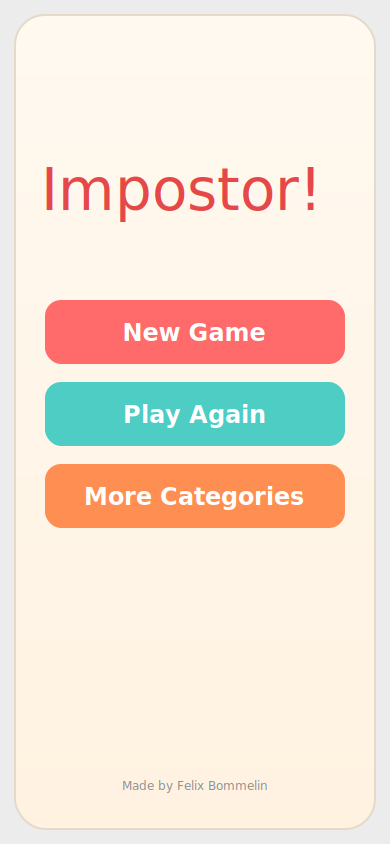

# Impostor!

Pass-the-phone party game played locally on one device.

## Author
Felix Bommelin

## Play Online
[https://bommelin.github.io/impostor-game/](https://bommelin.github.io/impostor-game/)

## Home Screen Preview


## Run Locally
```bash
npm install
npm run dev -- --host
```

## Current Game Loop
1. **Home**: `New Game`, `Play Again`, `More Categories`
2. **Choose players**:
   - set player count, impostor count, and names
   - open `Presets` to save/load/edit/delete player presets
   - presets store player names, player count, and impostor count (max 10)
3. **Choose Category**:
   - pick built-in categories
   - toggle enabled custom categories (shown as normal tiles under built-ins)
   - open custom-category selection via `More Categories` (button sits directly above the preview box)
   - start with `Let's Play!`
4. **Pass/reveal loop**:
   - pass screen (`I'm ready`)
   - swipe-to-peek private role reveal
5. **Ready to play** screen:
   - starting player
   - selected categories
   - impostor count
   - timer controls
6. **End Game**
7. **Round Over**: `Play Again`, `Back`, `Exit`

## Category Flows
- **Built-in categories**: configured in `src/wordBank.js`
- **Custom categories (management)**: Home → `More Categories`
  - create/edit/delete custom categories
  - browse predefined templates grouped by theme in the `Browse` tab
  - copy templates into personal custom categories
- **Custom categories (selection-only)**: Choose Category → `More Categories`
  - controls the **enabled custom categories** list (what appears on Choose Category)
  - `Add categories to selection` commits enabled categories
  - `Back` returns without applying draft changes
  - no create/edit/delete in this flow
  - includes `Create & browse categories` to temporarily open full management, then return

## Rules
- 2–12 players
- 1 to `N - 1` impostors
- Random word from selected category pool
- Random impostor assignment
- Random starting player
- Rare hidden all-impostor round (5% chance), revealed only after the round, with a 9-game cooldown after it occurs
- Voting is manual/off-device

## Persistence
- Saved players and setup values
- Player presets (`playerPresets`)
- Last selected categories
- Enabled custom category IDs
- Last selected custom category IDs (for round selection)
- Custom categories in local storage
- All-impostor cooldown counter in local storage
